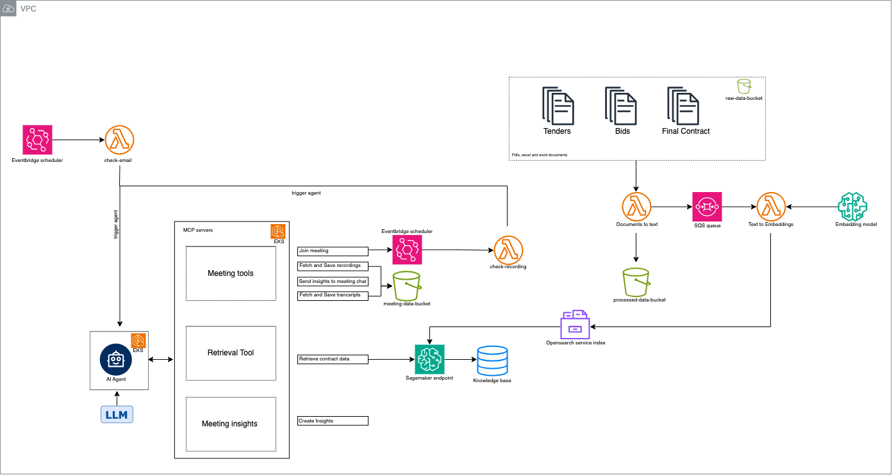
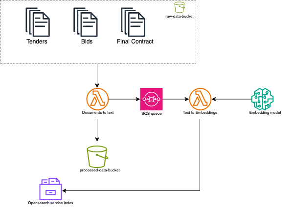
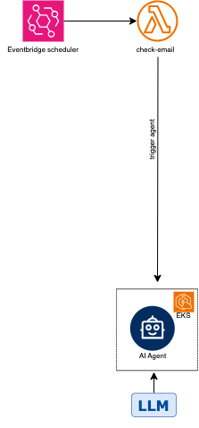
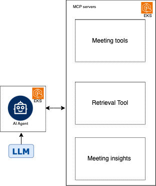

Modern construction projects generate and rely on a large volume of documentation — from **tenders**, **bids**, to the **final signed contracts**. Once construction begins, **stakeholder meetings** are held regularly via platforms like **Microsoft Teams** and **Zoom**.

> The task: Design a software architecture for an intelligent agent that participates in these meetings, listens to discussions, observes screen shares or visual content, and cross-verifies conversations against the official project documents.

---

### 🎯 Agent Objectives

The AI meeting agent is designed to:

1. 🧾 **Identify contractual discussions**: Detect when topics in the meeting relate to clauses or requirements in the signed contract.
2. ❗ **Validate alignment**: Confirm whether discussed items are already documented or require additions/changes.
3. ✍️ **Propose changes**: If additional work is discussed, the agent should suggest:
   - Amendments to existing contracts/specifications
   - Creation of **new contracts** or **addenda**

---
### 🔧 Tech stack

- **Cloud platform** - AWS
- **Language** - Python
- **Services** - AWS S3, AWS Lambda, AWS EventBridge, AWS SQS, Amazon SageMaker, Amazon Bedrock, Amazon OpenSearch Service, AWS EKS
- **Other tools** - MCP servers

#### 💡 AI Stack
- **LLM**: GPT-4 / Claude / Azure OpenAI / Bedrock
- **Embeddings**: OpenAI / Cohere / HuggingFace / Bedrock
- **Vector DB**: Opensource (FAISS / Weaviate / Pinecone) / AWS Opnsearch
- **Agent**: LangChain / Autogen


### 🧱 Proposed Solution Architecture
An application deploying infrastructure for a generative AI cross-platform online meeting insights agent. The agent is designed to be compatible with online meeting apps such as Microsoft Teams, Zoom, etc 



## 📂 **Document Ingestion & Knowledge Base**

Once the construction project is signed -  the final contract, tenders and bids are uploaded to S3 bucket. This triggers a Lambda function **documents-to-text**
- **Documents-to-text** - is responsible for fetching the document files from s3 such as pdf, excel and word documents. The content of the files are converted to text using OCR techniques like [Amazon textract](https://aws.amazon.com/textract/) / [Mistral OCR](https://mistral.ai/news/mistral-ocr). These text files are then saved in s3 under processed-files. For every new file created, the object file is pushed to an SQS queue.
- **SQS Queue** - The SQS queue is used for decoupling producer (**Documents-to-text**) and consumer (**text-to-embeddings**) Because if the embedding function is slow, fails, or needs to be updated, the **document-to-text** pipeline can still proceed. This allows independent scaling, error handling, and maintenance. It also enables us to implement retry and failure recovery if the **text-to-embedding** Lambda fails (e.g., due to API/model issues), SQS can retry automatically or send the message to a **dead-letter queue (DLQ)**. The s3 object files information pushed to SQS Queue is consumed by **text-to-embeddings** lambda.
- **Text-to-embeddings** - Read the processed s3 text files and implements a chunking mechanism to parse the text files and create embedding using models from **Sagemaker jumpstart / Huggingface models** and store these embedding as vector database in **AWS Opensearch service index** (can also use opensource DB like [cromadb](https://www.trychroma.com/). 

## 🛠️ **Meeting Agent Trigger**

Meeting Agent is backed by a mail account with necessary license to schedule and manage meetings.
To monitor this mail account, a **Event bridge scheduler** is used to trigger the lambda **check-email** which keeps checking the receiving email and if the email is a meeting invite, then the **AI Agent** is triggered with new meeting information.
The trigger to **AI Agent** would contain the following information.
* construction project name (the knowlegdebase of that project should be available in VectorDB)
* Meeting id to join
* Meeting date and time

## 🧠 **Agentic Workflow**

We have an AI agent created using **Autogen/Langchain framework** where the prompt engineering is performed with any LLM to integrate with MCP tools. 
The stakeholders of this construction project can add this agent using it's **email id** and make sure all the access is given for the agent mail id to access meeting contents.
The Agent will set with **system prompts** to perform the necessary tasks. To interact with Agent, A **FastAPI** WebSocket protocol, initiated via an HTTP GET request with an ```Upgrade: websocket``` header. Once the connection is established, it switches to the WebSocket protocol. This API is hosted using **AWS EKS**.

## 🛠️ **MCP servers**

The tools created for mcp servers can also be hosted as GET/POST methods using FastAPI depending on the use case. These http urls are connected to Agents to trigger the right tool.
**Meeting Tools**
Join meeting - When the agent mail id has ameeting invite for a construction project, this tool is triggered by the agent to create **Event bridge scheduler** is created to trigger **check-recording** lambda for every 15 mins based on the meeting end time. 
  Check-recording - Recording file status is checked using the incoming email from meeting recording ready-status - the **Event bridge scheduler** is deleted and triggers the Agent with Query as “recording file is ready in the url: <download-url>. Fetch and save the transcripts and recording from here” . If not, the status will be checked in another 15 mins.
```json
Input: { "meeting title" <value>, "construction_project_name": <value>, "antendeed mail id": <value>, "meeting_start_date_time": <value>, "meeting_end_date_time": <value>}
Output: <Event bridge creation status>
```

Fetch and Save recordings / transcripts - Using the Recording download url from check-recording lambda, the recordings and transcripts are fetched and stored in s3 ( transcripts are saved as text files. Recordings as saved as mp4)
```json
Input: <Download url of recording and transcripts>
Output: <S3 path of  recording and transcripts>
```

Retrieve contract data - The sagemaker endpoint is deployed to perform the following
Text files of transcripts are fetched from s3. Chunk them and classify each chunks into “contract related” and “non contract related”. 
For all the contract related chunks, 
  * the top k relevant information is retrieved from contract data stored in Opensearch service index. If information is retrieved - With the top k retrieved data and the contract related chunk as context, the LLM is queried to summarize the discussion in that part of the meeting along with line numbers in contract/bids/tender documents. If no relevant information in contract - summary is empty.
  * Based on the timing in the transcript chunks, the frame of the recording is fetched and saved.

All the necessary information is stored in a nosql database like **Dynamodb**. 
```json
{ “meeting_id”: <value>,
“data” : [
{“chunk_id”: <value>,
“contract summary”: <value> ,
“document line number”: <value>,
“recording_image”: <s3 path>,
“meeting_context”: <value>]}
```

Meeting Insights - Fetch the  Knowledge base using meeting_id. 
wherever Contract summary and  line numbers are not empty -create the list of items discussed as per summary.
wherever Contract summary is empty, use the Meeting_context and create the list of suggestions to change in the project documents.

Send Insights to meeting chat - Once the meeting insights are ready from past mcp call, using the meeting app API - send the insights to meeting chat.

Benefits of this solution:
✅ **Compatibility with any online meeting apps** - Meeting apps SDKs are integrated with MCP servers makes the agent compatible with any tool SDKs quickly.
✅ **Faster testing with different LLMs and Embedding models** - Using an agent based approach can help us test with multiple available LLMs and observe the results
✅ **Observability**: With autogen/langchain based agents, we can track cost, prompts, tokens and MCP tool tigger events.
✅ **Creation of meeting knowledge base**: A knowledge base is created based on the construction project documents and the meeting - which can help the user to interact with the meeting knowledge base for more insights.

## 🧠 Bonus Task

A small optimization is performed to support the live transcription data and faster response from the Agent. Most of the meeting appss support live transcription where when a person pause inbetween in the meeting window, the live transcription is updated. The architecture can be changes as below to support optimization in
* on meeting transcription data
* get insights from meeting by chating with the ai agent 
* faster insights from agent post-meeting by filtering contract based conversations from greetings and chit-chats during the meeting time.
[Architecture](../assets/bonus-architecture.png)

**Changes made**
* The join meeting **eventbridge scheduler** schedules at the vegining of the meeting time and gets access to meeting chat and window updates.
* Once meeting chat is accessed and for every live transcript update in meeting, the **process transcripts** tool is used to implement RAG for only project-related conversations with Contract database and save those ttranscripts as text files / create the no sql data for transcripts
* As recording is possible only after the meeting ends, the "recording ready" message to meeting chat will make the agent to fetch the recording and store them in knowledge base.
* AI agent as one of the participant in meeting chat can also help meeting atendees to ask any query once the knowledge base is ready and meeting insights are sent.


